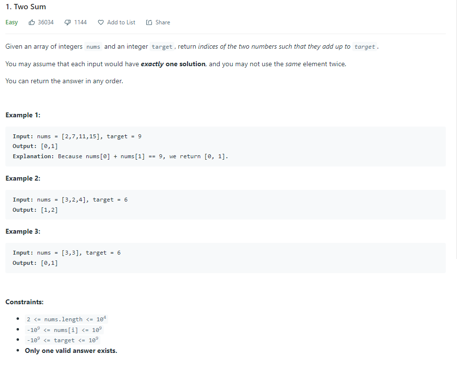
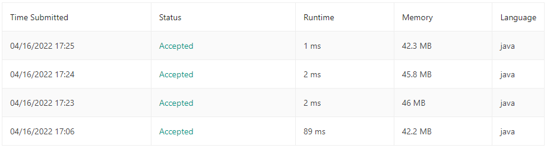

| LABEL | DESCRIPTION |
| :---        |    :---   |
| **PROBLEM** | **[1. Two Sum](https://leetcode.com/problems/two-sum)** |
| **LEVEL** | **EASY** |
| **DESCRIPTION** |  |
| **SUBMISSIONS** |  |

**MY SOLUTION** [CHECK HERE](https://leetcode.com/submissions/detail/681418998/)
```
class Solution {
    public int[] twoSum(int[] nums, int target) {
        HashMap<Integer, Integer> map = new HashMap<>();
        int[] res = new int[2];
        for(int i=0; i<nums.length; i++){
            int remainder = target - nums[i];
            if(map.get(remainder) != null){
                res[0] = i;
                res[1] = map.get(remainder);
                return res;
            }else{
                map.put(nums[i], i);
            }
        }
        return res;
    }
}
```

