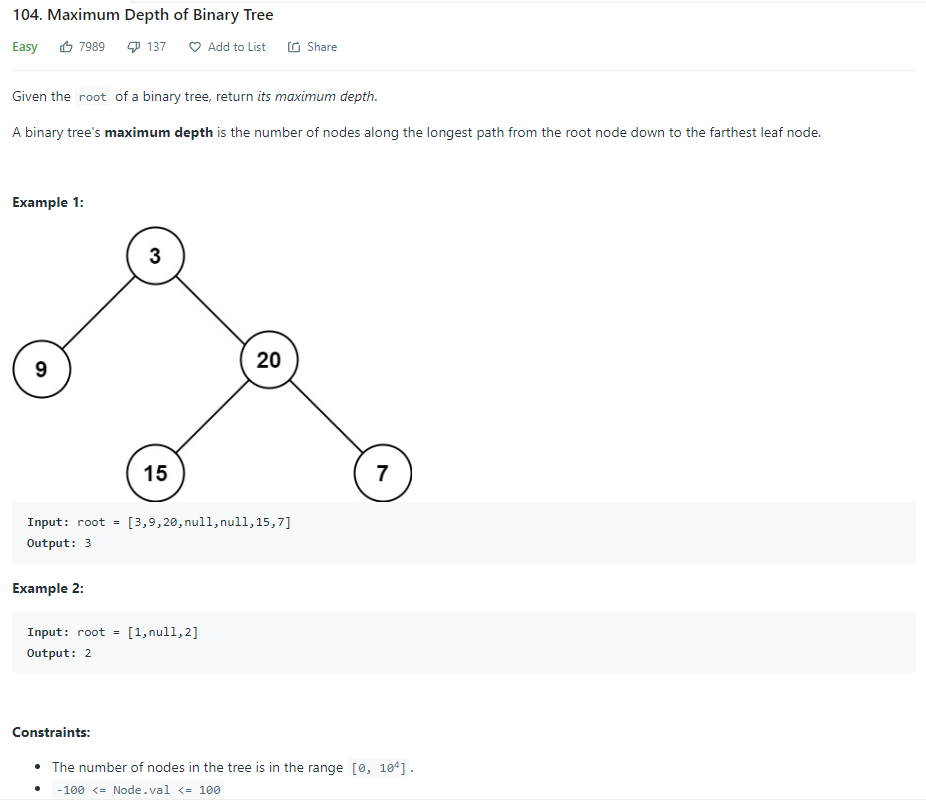

| LABEL | DESCRIPTION |
| :---        |    :----:   |
| **PROBLEM** | **[104. Maximum Depth of Binary Tree](https://leetcode.com/problems/maximum-depth-of-binary-tree)** |
| **LEVEL** | **EASY** |
| **DESCRIPTION** |  |
| **SUBMISSIONS** |  |

**MY SOLUTION** [CHECK HERE](https://leetcode.com/submissions/detail/641289378/)
```
class Solution {
    public int maxDepth(TreeNode root) {
        if (root == null) return 0;
        else {
            int left_depth = maxDepth(root.left);
            int right_depth = maxDepth(root.right);
            if(left_depth>right_depth){
                return left_depth+1;
            }else{
                return right_depth+1;
            }
        }
    }
}
```

