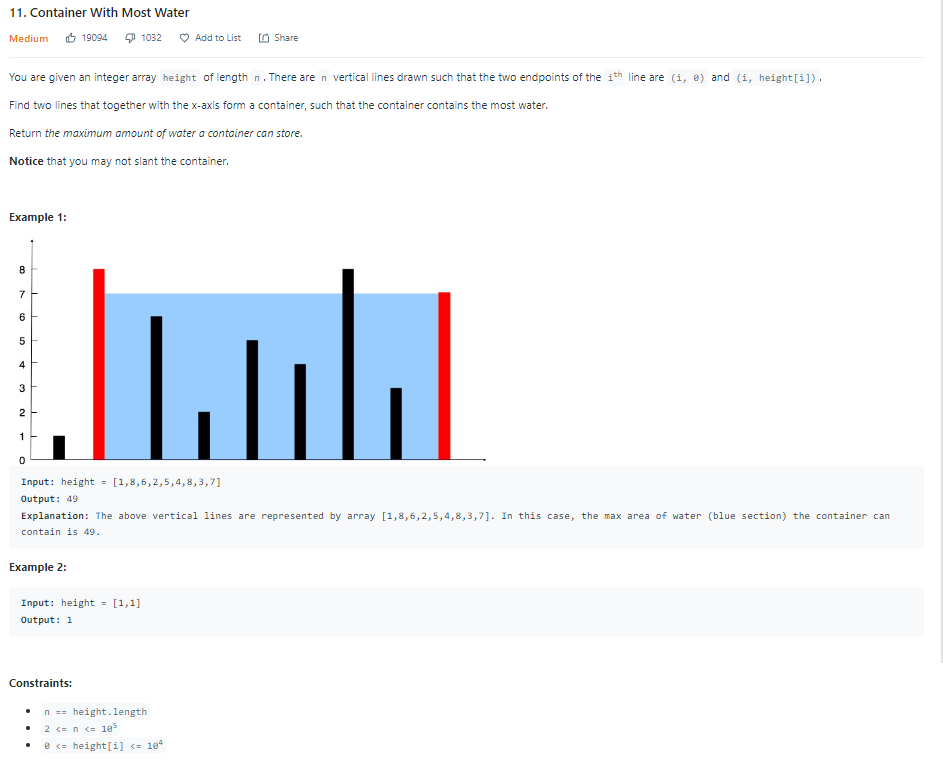
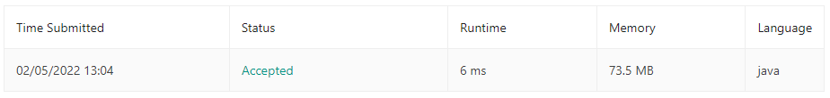

| LABEL | DESCRIPTION |
| :---        |    :----:   |
| **PROBLEM** | **[11. Container With Most Water](https://leetcode.com/problems/container-with-most-water)** |
| **LEVEL** | **MEDIUM** |
| **DESCRIPTION** |  |
| **SUBMISSIONS** |  |

**MY SOLUTION** [CHECK HERE](https://leetcode.com/submissions/detail/634836601/)
```
class Solution {
    public int maxArea(int[] height) {
        int len = height.length;
        int l_index = 0;
        int r_index = len-1;
        int max_area = 0;
        
        while(l_index<r_index){
            max_area = Math.max(max_area, Math.min(height[l_index], height[r_index]) * (r_index - l_index));
            if(height[l_index] < height[r_index])
                l_index += 1;
            else
                r_index-=1;
        }
        return max_area;
    }
}
```

