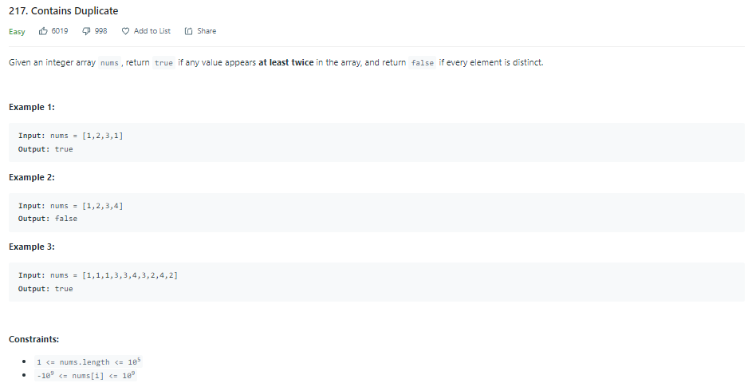
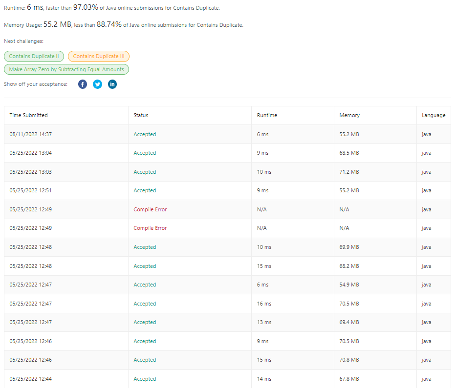
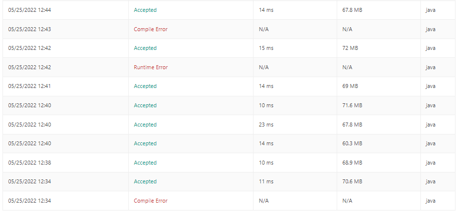

| LABEL | DESCRIPTION |
| :---        |    :---   |
| **PROBLEM** | **[217. Contains Duplicate](https://leetcode.com/problems/contains-duplicate)** |
| **LEVEL** | **EASY** |
| **DESCRIPTION** |  |
| **SUBMISSIONS** |   |

**MY SOLUTION** [CHECK HERE](https://leetcode.com/submissions/detail/706773288/)
```
class Solution {
    public boolean containsDuplicate(int[] nums) {
        Map<Integer, Boolean> numCount = new HashMap<>();
        for (int num : nums) {
            if (numCount.get(num)!=null && numCount.get(num)==true) {
                return true;
            } else {
                numCount.put(num, true);
            }
        }
        return false;
    }
}
```

