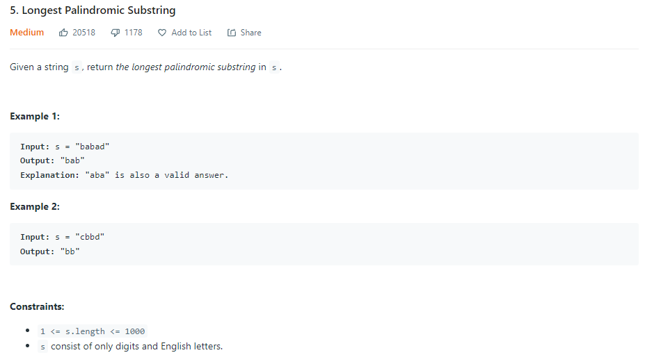

| LABEL | DESCRIPTION |
| :---        |    :----:   |
| **PROBLEM** | **[5. Longest Palindromic Substring](https://leetcode.com/problems/longest-palindromic-substring/)** |
| **LEVEL** | **MEDIUM** |
| **DESCRIPTION** |  |
| **SUBMISSIONS** |  |

**MY SOLUTION** [CHECK HERE](https://leetcode.com/submissions/detail/639493001/)
```
class Solution {
    public String longestPalindrome(String s) {
        int maxLength = 1; 
        int start = 0;
        int len = s.length();
 
        int low, high;
        for (int i = 1; i < len; ++i) {
            low = i - 1;
            high = i;
            while (low >= 0 && high < len && s.charAt(low) == s.charAt(high)) {
                --low;
                ++high;
            }
            ++low; --high;
            if (s.charAt(low) == s.charAt(high) && high - low + 1 > maxLength) {
                start = low;
                maxLength = high - low + 1;
            }
            low = i - 1;
            high = i + 1;
            while (low >= 0 && high < len && s.charAt(low) == s.charAt(high)) {
                --low;
                ++high;
            }
            ++low; --high;
            if (s.charAt(low) == s.charAt(high) && high - low + 1 > maxLength) {
                start = low;
                maxLength = high - low + 1;
            }
        }
        return s.substring(start, start + maxLength - 1 + 1);
    }
}
```

