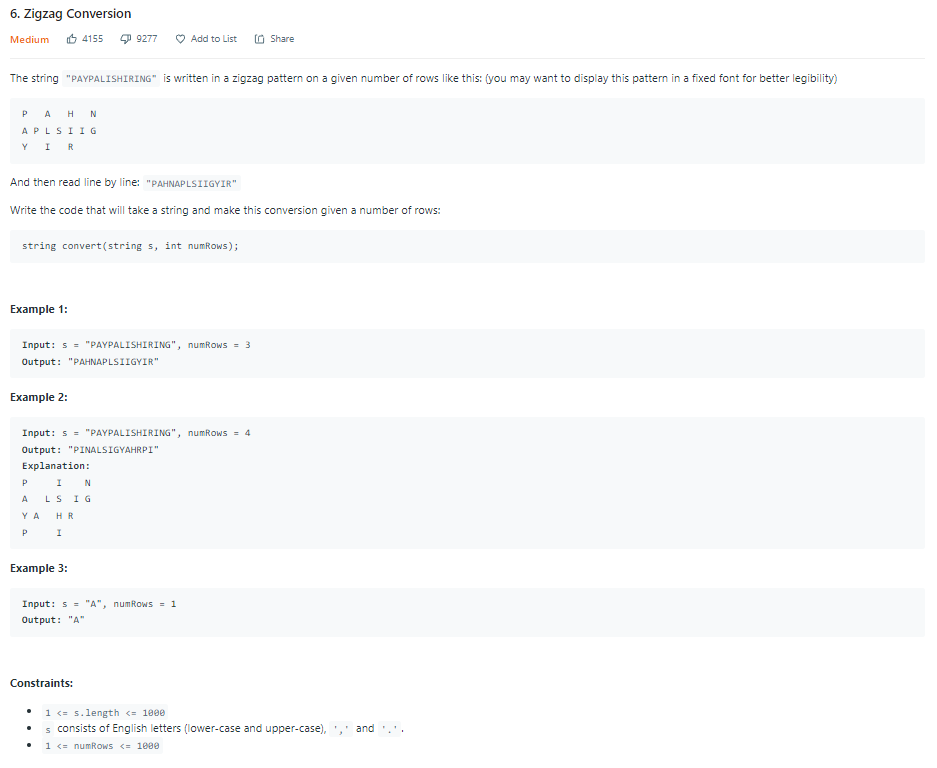
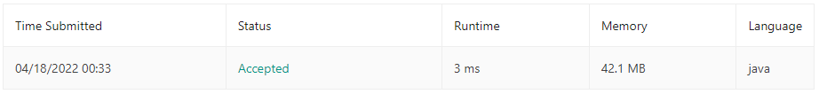

| LABEL | DESCRIPTION |
| :---        |    :----:   |
| **PROBLEM** | **[6. Zigzag Conversion](https://leetcode.com/problems/zigzag-conversion/)** |
| **LEVEL** | **MEDIUM** |
| **DESCRIPTION** |  |
| **SUBMISSIONS** |  |

**MY SOLUTION** [CHECK HERE](https://leetcode.com/submissions/detail/682331289/)
```
class Solution {
    public String convert(String s, int numRows) {
        if(numRows <= 1) return s;
        StringBuilder res = new StringBuilder();
        for(int rowNum = 0; rowNum < numRows; rowNum++){
            int i = rowNum;
            boolean up = true;
            while(i < s.length()){
                res = res.append(s.charAt(i));
                if(rowNum == 0 || rowNum == numRows - 1){
                    i += (2*numRows-2);
                }else{
                    if(up){
                        i += (2*(numRows - rowNum) - 2);
                    }
                    else{
                        i += rowNum * 2;
                    }
                    up ^= true;
                }
            }
        }
        return res.toString();
    }
}
```

